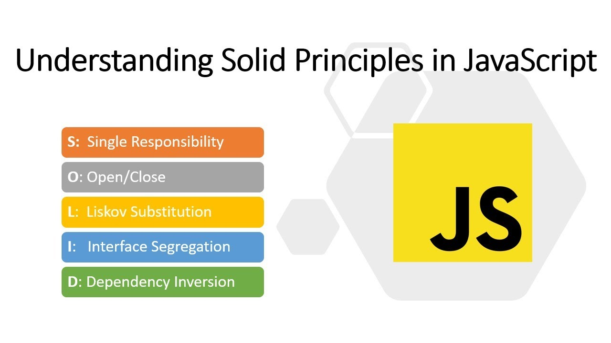
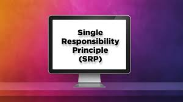
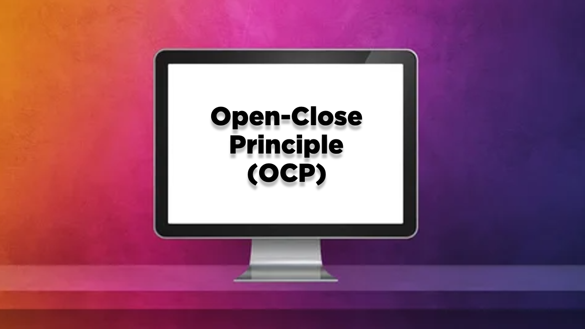
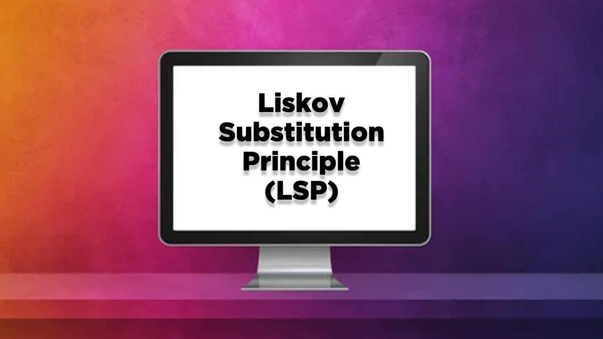
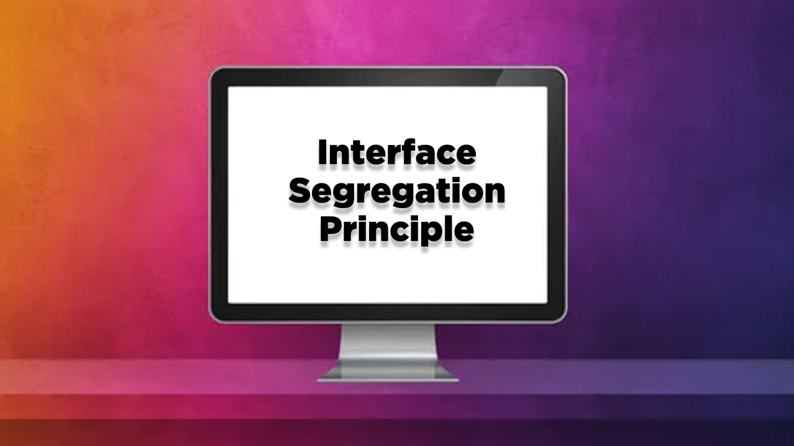
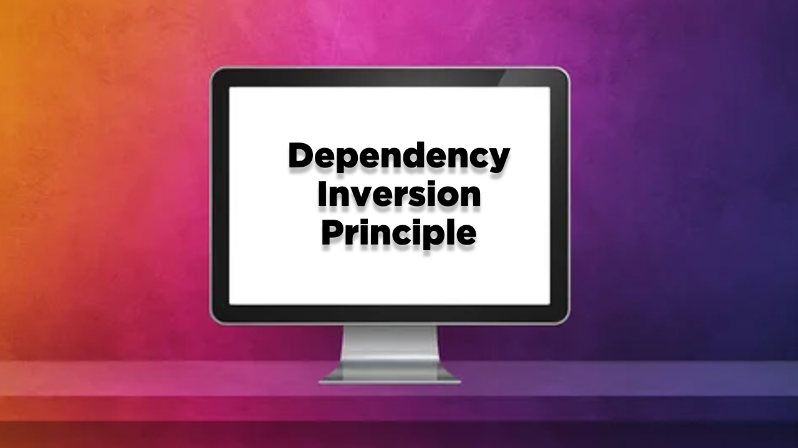

# SOLID Principles

## Introduction

SOLID principles are a set of design principles that help developers create software that is more maintainable, understandable, and scalable. Introduced by Robert C. Martin, these principles form a foundation for object-oriented programming (OOP) design. Adhering to SOLID principles can lead to better software architecture and easier code management.

### The Five SOLID Principles:

1. **Single Responsibility Principle (SRP)**: 
   A class should have only one reason to change, meaning it should have only one responsibility. This principle helps to keep classes focused and manageable.

   

2. **Open/Closed Principle (OCP)**:
   Software entities (classes, modules, functions, etc.) should be open for extension but closed for modification. This principle allows you to add new functionality without altering existing code.

   

3. **Liskov Substitution Principle (LSP)**:
   Objects of a superclass should be replaceable with objects of a subclass without affecting the correctness of the program. This principle ensures that a subclass can stand in for its superclass.

   

4. **Interface Segregation Principle (ISP)**:
   No client should be forced to depend on methods it does not use. This principle advocates for small, specific interfaces instead of large, general-purpose ones.

   

5. **Dependency Inversion Principle (DIP)**:
   High-level modules should not depend on low-level modules; both should depend on abstractions. This principle promotes the decoupling of software modules.

   

## YouTube Course

You can watch the complete course explaining these principles in detail on YouTube through the following link:

[SOLID Principles Course on YouTube](https://www.youtube.com/playlist?list=PLOldSEMXUdZvAyid_1BWHnExKObbKeajJ)

## How to Use

You can use this repository as a reference to understand SOLID principles and apply them in your software projects. If you have any questions or need further clarifications, feel free to open issues in this repository.

## Contribution

If you would like to contribute to improving the content or adding new information, please feel free to create a Pull Request.

## License

This project is licensed under the [MIT License](LICENSE).
